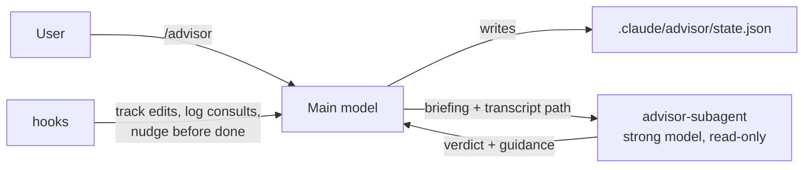

# Advisor

Advisor gives Claude Code a stronger second model to consult at key points: before a major decision, when it is stuck on an error, and before it declares a task done. The main model keeps doing the work; the advisor reads a full briefing (and the conversation transcript when available), thinks hard, and returns a verdict with concrete guidance. You get higher quality on complex tasks while paying for the strong model only where it matters.

The default advisor is Claude Opus at its highest reasoning effort. Because the advisor is a subagent with its own model, it does not have to be the model you are chatting with: any model available to subagents works, so a second opinion can come from a different model family.

## Installation

```bash
/plugin marketplace add vramirez/claude-skills
/plugin install advisor@claude-skills
```

## Quick start

```text
/advisor                     turn on with the default advisor (opus, xhigh effort)
/advisor sonnet              turn on with a different model (sonnet, opus, haiku, fable, or a full model ID)
/advisor ask is this migration safe to run twice?
/advisor status
/advisor off
```

Then work as usual. When the agent hits a checkpoint it consults the advisor and reports back in a line or two:

```text
Advisor (opus): proceed with changes. The retry wrapper hides the real
failure; the 401 comes from a stale token cache. Dropped the retry, fixed the cache key.
```

To keep the skill in context for a whole session, invoke `/advisor` with Option+Enter (macOS) or Alt+Enter (Windows/Linux) to run it as a Custom Mode. The state file works either way.

## How it works



- **Skill `advisor`** implements the `/advisor` command and the checkpoint protocol: when to consult, how to write the briefing, how to act on the verdict, and how to report it. See [skills/advisor/SKILL.md](skills/advisor/SKILL.md) and the [briefing template](skills/advisor/references/briefing-template.md).
- **Agent `advisor-subagent`** is a read-only subagent pinned to a strong model (`opus` at `xhigh` effort by default, overridden per session by `/advisor <model>`). It verifies the briefing against the repository, reads the transcript when a path is available, and answers with `Verdict / Why / Recommendations / Risks / Answers / Confidence`.
- **Hooks** keep the mode honest without adding chatter: `PostToolUse` (on Edit and Write) records that files changed since the last consult, `SubagentStop` counts each consult and appends the advice to `.claude/advisor/log.md`, and `Stop` posts a one-line `[Advisor]` follow-up when a turn ends with unreviewed edits so the pre-completion consult is not skipped. The nudge fires at most once per batch of edits, stays quiet when the agent ended its turn with a question for you, and can be disabled with `/advisor nudge off`.

## Checkpoints

| Checkpoint | Trigger |
| --- | --- |
| Major decision | Choosing between approaches; migrations, deletions, public API or config changes, dependency swaps, auth or payment code; requests ambiguous enough to change the work. |
| Stuck | Same error or failing test after two real attempts; unexplained behavior; about to add a workaround (retry loop, `sleep`, broad `try/except`, skipped test, disabled check). |
| Before declaring done | Any task that changed logic or touched more than a couple of files. Trivial edits are skipped and said so. |
| On request | `/advisor ask ...`, or asking what the advisor thinks. |

The skill caps this at roughly four consults per task and never consults for routine steps or things the agent can verify itself.

## Models

The default is Claude Opus at its highest reasoning effort (`opus`, `effort: xhigh`). `/advisor <model>` accepts `sonnet`, `opus`, `haiku`, `fable`, or a full model ID; a family name resolves to that family's latest model at its highest reasoning tier. If Cursor rejects a slug, the skill picks the closest valid one from the error, saves it, and tells you. Team model restrictions and plan limits apply to the advisor like any subagent.

## State

Everything lives in `.claude/advisor/` at the project root and is safe to delete at any time:

| File | Purpose |
| --- | --- |
| `state.json` | Mode, model, nudge setting, consult count, bound session, transcript path. |
| `log.md` | Every completed consult with its verdict, for later review. |
| `pending` | Marker: files changed since the last consult. |
| `last-response.txt` | Tail of the latest reply, used to avoid nudging over a question to you. |

Add `.claude/advisor/` to your `.gitignore` if you do not want it in the repository; the skill never stages it.

## Cost

Each consult is one call to the advisor model with a briefing of a few thousand tokens plus whatever the advisor chooses to read. Selective use is the point: a typical feature takes one to three consults. The default advisor, Grok 4.6, draws from the Cursor Models usage pool, so it is the cheapest of the strong options; switch models when you want a different family's perspective.

## Limitations

- State is per project, bound to the session that enabled it. Running `/advisor` in a second session on the same project re-binds the mode there (model and nudge settings carry over; the consult history and advisor context start fresh). Use `/advisor status` to look without re-binding.
- The transcript path is recorded by hooks, so the advisor only reads the full transcript when hooks run and transcripts are enabled. It always receives the briefing.
- The end-of-turn nudge relies on the plugin's hooks; where hooks do not run, the skill still performs the pre-completion consult on its own.

## License

MIT
